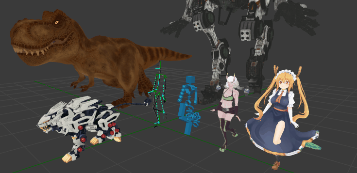

<h1>IK Wonderland</h1>

Welcome all to **IK Wonderland**. This ebook is in the early stages of writing & development. The purpose of the book is to
have in written form all the knowledge I've aquired in this niche field of development. We'll begin with some data types & structures
to create a skeletal system then start talking about various skinning methods that you can use. We'll explore animations & retargeting so you can get your characters smoving. Then end things with an in depth dive into inverse kinematics. We'll go through some well know solves plus a collection of personally created ones.

The main languages I'll be using in the examples will be **Javascript** & **GLSL**. That's just to get a general idea of things are coded plus something you can see running in your browser. Hopefully things will be written well enough where the knowledge is general enough for anyone to create their system whatever language is preferred.

### [Ossos](https://github.com/sketchpunklabs/ossos) <!-- {docsify-ignore} -->

To get a glimps of what I'll be discussing in the book, you can take a peek 
at Ossos *( portugues for bones )*. It's an opensource project to bring a full character animation
package to any webbased app using **webgl** or **webgpu**. The project is currently under a rewrite, so the next version
can be viewed in the **ossos_next** branch.

### Old Youtube Tutorials <!-- {docsify-ignore} -->
If you want some video content, I have various youtube tutorial videos you can watch related to character animations & IK.
- [WebGL2 : 132 : Animation Retargeting](https://www.youtube.com/watch?v=c9qBhFsAIIg)
- [WebGL2 : 134 : Data Texture Skinning](https://www.youtube.com/watch?v=QF4Kk4KQoII)
- [WebGL2 : 135 : Quaternion Inverse Direction](https://www.youtube.com/watch?v=hT5asIUBoX8)
- [WebGL2 : 136 : Quaternion Swing & Twist](https://www.youtube.com/watch?v=Hc2eHJUOEBE)
- [WebGL2 : 137.0 : IK Rigs Intro](https://www.youtube.com/watch?v=OMmXo3Jejxk)
- [WebGL2 : 137.1 : IK Rigs - Hips ](https://www.youtube.com/watch?v=G6u-6yaf-VA)
- [WebGL2 : 137.1 : IK Rigs - Limbs ](https://www.youtube.com/watch?v=1IRTe69XT_A)
- [WebGL2 : 137.1 : IK Rigs - Feet ](https://www.youtube.com/watch?v=atNiBwL7aTg)
- [WebGL2 : 137.1 : IK Rigs - Grounding ](https://www.youtube.com/watch?v=t1nE8UBsWvQ)
- [WebGL2 : 137.1 : IK Rigs - Spline ](https://www.youtube.com/watch?v=wanZew7PVEo)
- [WebGL2 : 137.1 : IK Rigs - Head & Springs ](https://www.youtube.com/watch?v=LoTlHB_IZg8)

## Contact & Support <!-- {docsify-ignore} -->
- Create a [GitHub issue](https://github.com/sketchpunklabs/ikwonderland/issues) for bug reports, feature requests, or questions
- Add a ⭐️ [star on GitHub](https://github.com/sketchpunklabs/ikwonderland) or ❤️ [tweet](https://twitter.com/intent/tweet?url=https%3A%2F%2Fgithub.com%2Fsketchpunklabs%2Fikwonderland&hashtags=javascript) to support the project!

## License <!-- {docsify-ignore} -->

All code samples are under the [MIT license](https://github.com/sketchpunklabs/ikwonderland/LICENSE).

Copyright (c) Sketchpunk Labs ([@sketchpunklabs](https://twitter.com/sketchpunklabs))
